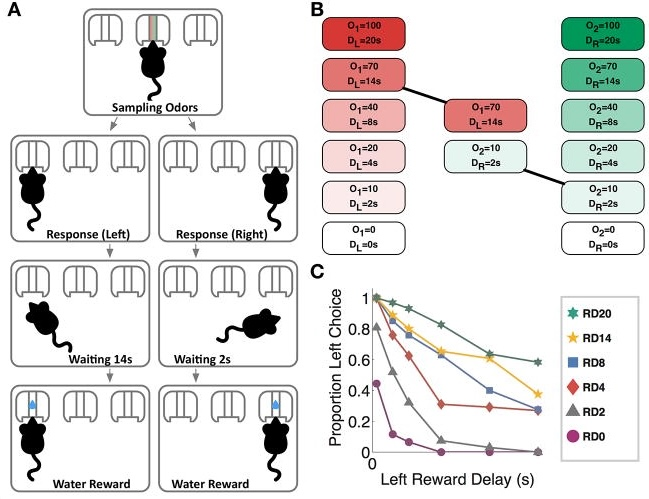

# Serotonin and patience at the moment of choice

*Serotonin at the moment of choice.*

I built a mouse decision-making task to ask when serotonin changes a choice: before waiting begins, at the moment an animal decides whether a larger future reward is worth the delay.

Would you rather have one reward now, or a better reward later? That everyday dilemma is called **intertemporal choice**. It is central to patience, impulsivity, addiction, self-control, and the way brains compare the pull of the present against the value of the future.

Serotonin had long been linked to patience. Older lesion and pharmacology studies suggested that disrupting serotonin made animals choose more impulsively, and newer recordings showed that dorsal raphe serotonin neurons responded to reward-predicting cues. But a precise causal question was still open: does serotonin change the decision itself, at the moment of choice, or does it act later by changing movement, waiting, thirst, or reward consumption?

To answer that, I needed a task with a clean decision point. Cued intertemporal-choice tasks with this structure were well established in humans and primates, but not in genetically tractable rodents where one can manipulate identified neurons in real time. I developed a **novel odor-guided intertemporal choice task for mice**. On each trial, a mouse sampled an odor mixture, chose left or right, and then waited for a water reward. The odors told the mouse how long each side would take; one option could be smaller and sooner, while the other could be larger but delayed.

The key design was that the animal made its choice *before* the waiting period began. Reward delays were interleaved trial by trial, so the mouse could not simply follow a fixed habit. Trial duration was also controlled, so choosing the sooner reward did not let the animal earn more trials per session. This made it possible to test a specific hypothesis: whether serotonin activity at the cue-guided decision point biases the animal toward patience.

Using optogenetics, I transiently inhibited or activated genetically identified dorsal raphe serotonin neurons during that decision window. The effects were bidirectional. Inhibiting these neurons made mice more likely to choose the sooner, smaller reward. Activating them made mice more willing to wait for the larger reward. These effects were not uniform across the task: they were strongest when the mouse faced a real trade-off, where neither option was obviously better.

I analyzed the behavior with a generalized linear model that treated choice as a function of the two offered delays and their interaction. This was important because the serotonin effect was not just "more left" or "more right." The model showed that serotonin changed how the animal combined delay information across the two options — in other words, it altered the computation of the trade-off itself.

The circuit story pointed downstream to the nucleus accumbens, a reward-related target of dorsal raphe serotonin neurons. Manipulating serotonin projections to this region produced similar effects, suggesting one pathway by which serotonin can bias decisions toward larger delayed rewards.

This work was published in *Current Biology* as ["Dorsal Raphe Serotonergic Neurons Control Intertemporal Choice under Trade-off."](https://pubmed.ncbi.nlm.nih.gov/28988863/) I later presented it as an invited talk at the CoSyNe 5-HT Workshop in Cascais, Portugal in 2019. For me, the project remains a template for how I like to do science: invent the behavioral assay that makes the hidden computation measurable, perturb the relevant circuit at the right moment, and use a model that captures the structure of the decision.

