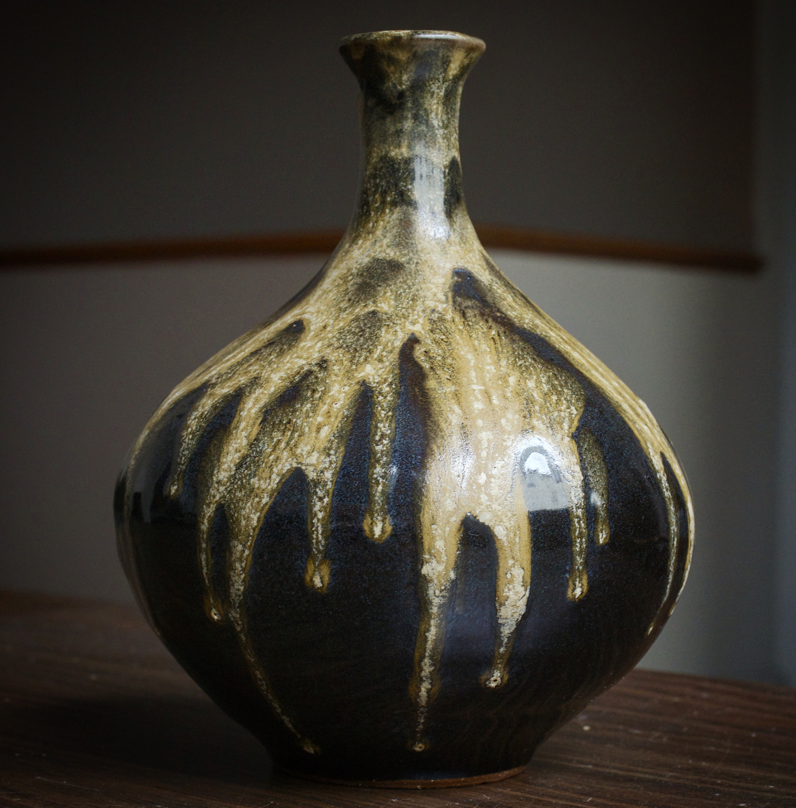
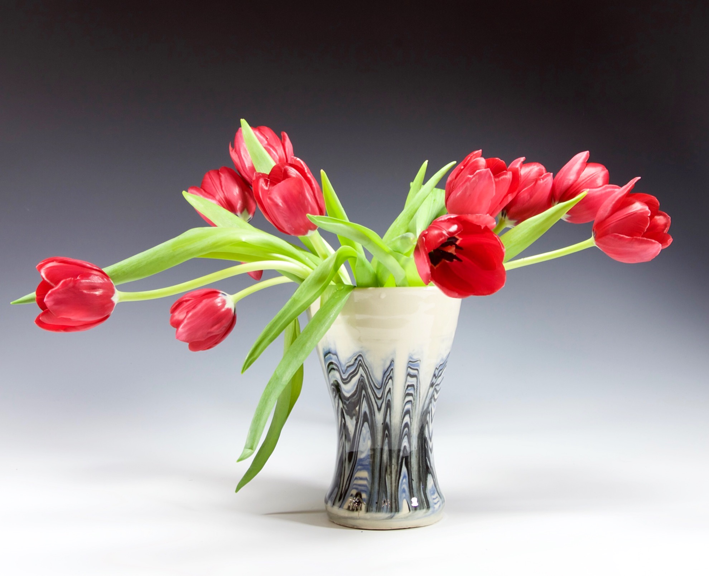

```{=html}
<div class="page-header">
  <h1>Art &amp; Music</h1>
  <p class="subtitle">"The bridge between art and science runs in both directions."</p>
</div>

<div class="art-intro">
  <p>
    Tufte argued that good data visualisation is an aesthetic act. I&rsquo;d add that good
    ceramics requires the same systematic thinking as a benchmarking framework. These aren&rsquo;t
    hobbies separate from my science &mdash; they&rsquo;re the same impulse: find the form that
    makes the invisible legible.
  </p>
</div>

<div class="section-divider">&bull;</div>

<!-- PAINTING -->
<div class="art-section">
  <h2>Painting</h2>
  <p class="art-meta">22nd UOB Painting of the Year Exhibition &bull; Singapore &bull; 2003</p>
  <p>
    Oils and acrylics. Drawn to atmosphere, gesture, and the moment before a form resolves
    &mdash; the suspended instant where something is almost but not yet identifiable.
    The same interest in thresholds that shapes my behavioural science.
  </p>
  <div class="gallery-grid">
    <div class="gallery-item">
      
      <div class="gallery-caption">Dusk. Oils on canvas, 2003. UOB Painting of the Year.</div>
    </div>
    <div class="gallery-item">
      
      <div class="gallery-caption">Portrait study. Oils on paper.</div>
    </div>
    <div class="gallery-item">
      
      <div class="gallery-caption">City, dusk. Oils, palette knife.</div>
    </div>
    <div class="gallery-item">
      
      <div class="gallery-caption">Bay. Oils on canvas board, plein air.</div>
    </div>
  </div>
</div>

<div class="section-divider">&bull;</div>

<!-- CERAMICS -->
<div class="art-section">
  <h2>Ceramics</h2>
  <p class="art-meta">The Art of the Cup &bull; Cambridge, MA, USA &bull; 2014</p>
  <p>
    Functional vessels. Wheel-thrown stoneware, with interest in the conversation between
    thrown form and surface treatment &mdash; where the physics of clay meeting resistance
    produces an outcome that is partly designed and partly discovered.
    That negotiation is the interesting part.
  </p>
  <div class="gallery-grid">
    <div class="gallery-item">
      
      <div class="gallery-caption">Mug with curl handle. Stoneware, celadon glaze. The Art of the Cup, 2014.</div>
    </div>
    <div class="gallery-item">
      
      <div class="gallery-caption">Spiral plate. Stoneware, celadon glaze.</div>
    </div>
    <div class="gallery-item">
      
      <div class="gallery-caption">Sea-urchin vessel. Stoneware, cobalt glaze.</div>
    </div>
    <div class="gallery-item">
      
      <div class="gallery-caption">Bottle vase. Stoneware, ash temmoku glaze.</div>
    </div>
    <div class="gallery-item">
      
      <div class="gallery-caption">Nerikomi vase. Marbled porcelain.</div>
    </div>
  </div>
</div>

<div class="section-divider">&bull;</div>

<!-- MUSIC -->
<div class="art-section">
  <h2>Music</h2>
  <p class="art-meta">Classical Soprano &bull; Singapore, Prague, international</p>

  <div class="music-block">
    <p class="award-label">Gold Medal</p>
    <h3>17th International Festival of Advent and Christmas Music</h3>
    <p>Prague, Czech Republic &bull; 2007</p>
  </div>

  <p style="margin-top: 1.5rem;">
    Studied voice at UC San Diego (Minor: Music) and performed in Singapore and internationally.
    Repertoire centred on Baroque and early Classical: Bach, Handel, Purcell, Vivaldi.
  </p>
  <p>
    The discipline of singing &mdash; breath, phrase, the physics of resonance &mdash; shares
    more with experimental design than it might seem. Both require understanding what the
    system will and will not do, and working with rather than against its constraints.
  </p>
</div>

<div class="section-divider">&bull;</div>

<!-- TUFTE NOTE -->
<div class="art-section" style="max-width: 720px; margin-left: auto; margin-right: auto;">
  <div class="tufte-note">
    <p>
      The whorlmap visualisation I designed for DABEST is both a statistical tool and a
      design object. Every aesthetic decision &mdash; colour, spacing, the choice to show
      the bootstrap distribution as a half-violin rather than error bars &mdash; was made
      to communicate uncertainty honestly and beautifully.
    </p>
    <p>
      That is not a coincidence. It is the same skill as deciding where the glaze should
      pool on a thrown form, or how long to hold a phrase before resolving it.
      The question in each case is: what is the minimum you need to show, and how do you
      show it so clearly that nothing else needs to be said?
    </p>
  </div>
</div>
```
