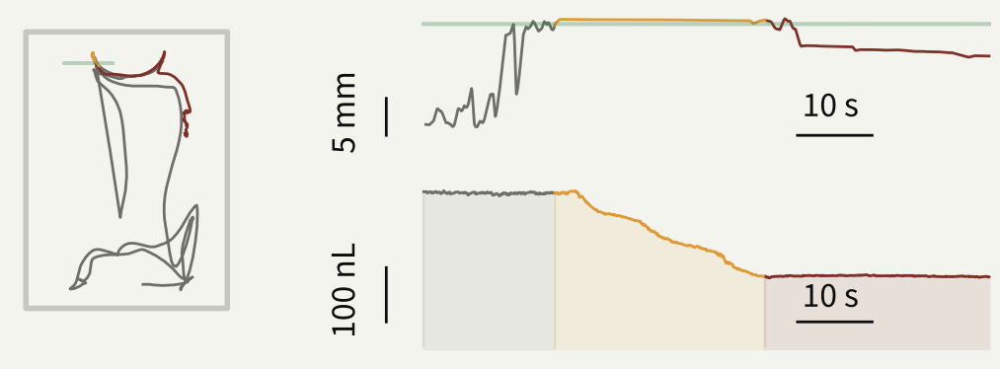

# Contextualized Ethomics

*When one metric lies, the whole behavioral profile tells the truth.*

::: {style="float:right; width:48%; margin-left:1.5em; margin-bottom:1em;"}

:::

Feeding research often judges neural manipulations by a single readout — how much an animal ate, or how often it approached food. But hunger and satiety are whole-body states, expressed across many behavioral dimensions at once. A manipulation that changes one metric might reflect hyperactivity, motor impairment, or a thirst effect rather than genuine state control. This project was built around the question of how to tell the difference.

  <video src="../images/blog/02_ethomics_files/feedingmovie_small.mp4" autoplay muted loop playsinline style="display:block; width:100%; border-radius:4px;"></video>

We developed an automated system called **Espresso** to track meal-by-meal feeding and locomotion in individual flies, then built a benchmarking framework called **DESTRA** (delta ethomic state-transition recapitulation assessment). Instead of asking whether a neural manipulation changed feeding, DESTRA asks whether it recreated the full multidimensional behavioral fingerprint of a real hunger-to-satiety transition. Applied to serotonergic circuits in [*Drosophila*]{.species}, the approach identified a specific neuronal population — marked by the tryptophan hydroxylase enhancer *Trhn* — whose activation authentically recapitulated satiety across feeding, locomotion, and post-meal behavior. The broader method provides a principled way to distinguish genuine state-control circuits from interventions that produce behavioral artifacts.

*Full page coming soon — paper currently in revision.*
