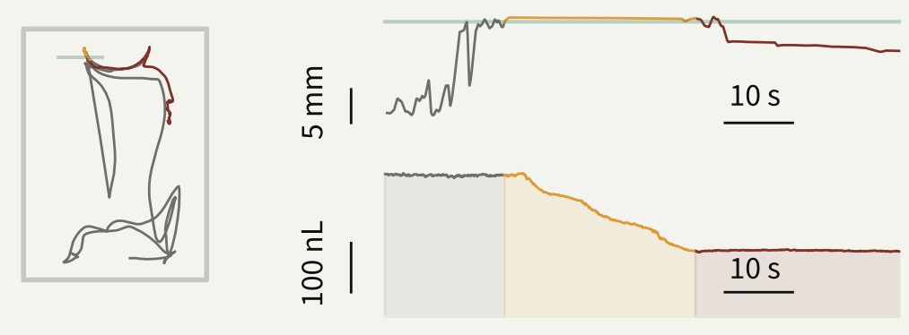
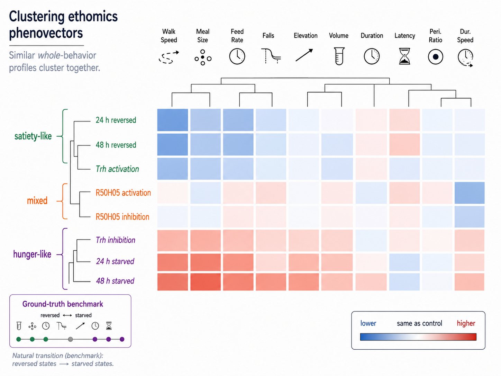

# Contextualized Ethomics

## When one metric lies, the whole behavioral profile tells the truth.

::: {.callout-note title="The method in one glance"}
**1. Ground-truth transition vector.** Natural starvation defines the hunger-satiety benchmark.

**2. Whole-profile matching.** Neural manipulations are compared by their full behavioral phenovector, not one metric at a time.
:::

A hungry fly doesn't only eat more. It searches differently, climbs differently, loiters near food differently, takes bigger meals, and changes how it moves after eating. Hunger and satiety are not single behaviors; they are coordinated internal states, expressed across many behavioral dimensions at once. That is what makes them biologically interesting, and also what makes them surprisingly easy to mis-measure.

Feeding research often relies on one convenient readout: total food consumed, feeding frequency, latency to feed, time near food, walking speed. These metrics are useful, but any one of them can be a little sneaky. A fly might eat less because it is sated, but it might also eat less because it is sluggish, stressed, uncoordinated, or doing some other fly thing we did not think to name. A fly might visit food more often because it is hungry, but it might also be hyperactive or exploratory. So the question behind this project was not just, **does this circuit change feeding?** It was, **does this circuit recreate the behavioral fingerprint of a real internal state?**

<video src="../images/blog/02_ethomics_files/feedingmovie_small.mp4" autoplay muted loop playsinline style="display:block; width:100%; border-radius:4px;"></video>

To answer that, we built an automated assay called **Espresso**, which tracks meal-by-meal feeding and locomotion in individual flies. Espresso measures nanoliter-scale food intake from a capillary while also recording where the fly goes, how fast it walks, when it visits the food port, how large its meals are, and how movement changes after eating. The point was not to collect more metrics for the sake of it. The point was to measure feeding in context, because hunger is not just food volume. It is a pattern.

The framework we developed from this is called **DESTRA**, or **delta ethomic state-transition recapitulation assessment**. The idea is simple: first, use a natural manipulation to define a reference state transition. In this study, starvation gave us that reference. Fed, 24-hour-starved, and 48-hour-starved flies define a natural hunger-satiety axis. For each behavioral feature, we measured how much it changed along that axis, then combined those effect sizes into a multidimensional **state-transition vector**.

Then we asked what neural manipulations do in the same behavioral space. Activate or inhibit a circuit, measure the same features, and you get a **phenovector**: the behavioral signature of that perturbation. Instead of asking whether a circuit changes one feeding metric, DESTRA asks whether the full phenovector aligns with the natural hunger-satiety transition. In other words: does the manipulation merely poke one behavior, or does it move the animal into a coherent state?

This distinction turned out to matter. We applied the framework to serotonergic circuits in *Drosophila*, where serotonin has a wonderfully messy history in feeding. Depending on the neurons studied, serotonin has been reported to suppress feeding, promote feeding, or alter food-seeking behavior. Measured one metric at a time, several circuits could look like "feeding circuits." But their full behavioral profiles told different stories.

The clearest state-like effects came from neurons marked by the **tryptophan hydroxylase enhancer Trhn**. Activating Trhn neurons in hungry flies produced a satiety-like phenovector. Inhibiting Trhn neurons in fed flies produced a hunger-like phenovector. These effects were not limited to food volume; they extended across meal structure, locomotion, food approach, and post-meal behavior. By contrast, other feeding-related circuits produced more fragmented profiles: real behavioral effects, but not convincing recapitulations of natural hunger or satiety.

Manipulations placed by their full phenovector, not one metric at a time. Trhn activation and inhibition land on opposite ends of the natural hunger–satiety axis; other feeding-related circuits scatter into fragmented profiles.

That is the larger point of contextualized ethomics. A neural circuit should not be called a state-control circuit just because it changes one behavior. Internal states are distributed things. They reveal themselves through coordinated patterns, not isolated readouts. One metric may be useful, elegant, even necessary, but the full behavioral profile is harder to fool.

[Preprint on bioRxiv &nearr;](https://doi.org/10.64898/2026.07.01.735755). More broadly, this is a framework for inferring hidden biological states from high-dimensional behavior, which is where I think neuroscience, bioinformatics, and AI-assisted measurement can get very interesting.

This work was done in collaboration with Xianyuan Zhang, James C. Stewart, Joses Ho, Deepak Choudhury, Zhiping Wang, and <a href="https://www.claridgechang.net/people.html" target="_blank">Adam Claridge-Chang</a>.

