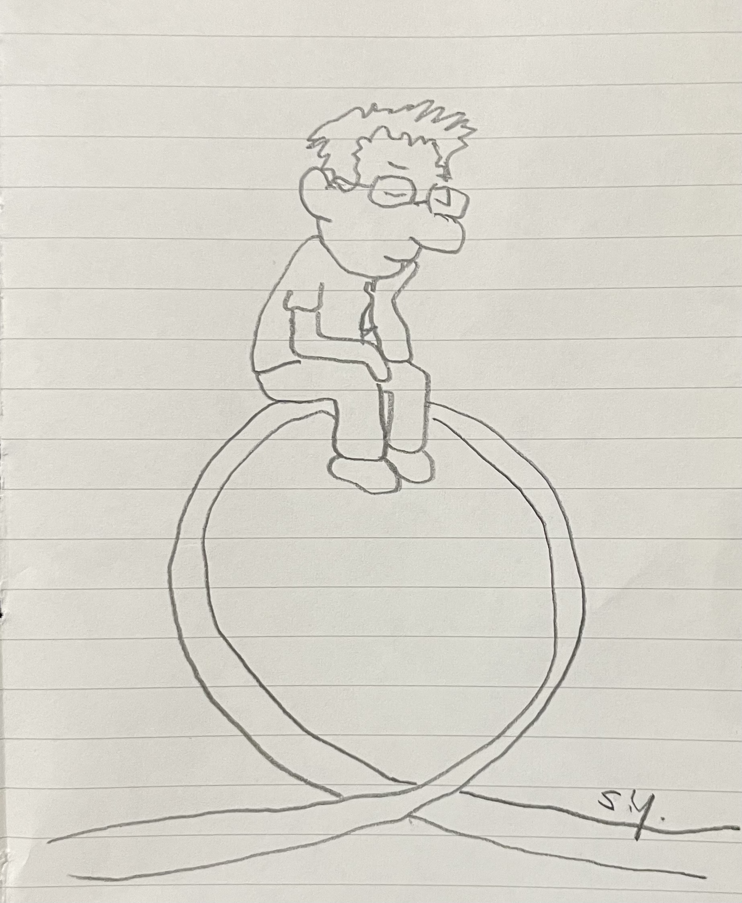

# Four Agents, No Ground Truth

I have been using LLMs to help me code for about a year now, and I am not going to pretend it didn't help much. It feels like I 10×'ed.

Not because the models magically know what I want. They often very much do not. But because they are extremely good at connecting my half-formed intentions to already-existing solutions: plotting libraries, packaging tools, literate programming frameworks, website generators, notebook cleanup, GitHub workflows. When the LLM reaches for the right known tool instead of hard-coding a tiny castle in the sand, I can move very fast.

This has been especially powerful for the kind of work I do: scientific software, analysis notebooks, visualization, teaching materials, and and especially small web artifacts around research. I am usually not trying to build a giant production system. I am trying to make something that helps a scientist think: a plot, a demo, a tutorial, a figure, a clearer explanation of an analysis. The whorlmap figure repo (https://github.com/sangyu/whorlmap-paper) was build with Claude Code.

But the "human in the loop" part is not a slogan to me. It is the actual work.

::: {style="float:right; width:40%; margin-left:1.5em; margin-bottom:0.5em;"}

:::

LLMs are very good at producing plausible next steps. They are also very good at producing work that looks finished before it really is. The gap between "this ran" and "this looks exactly right" is still where the human scientist, designer, editor, and domain expert matters.

I find myself most needed in two places: design and goal-keeping.

By design, I mean both algorithmic design and graphical design. Does this abstraction actually fit the problem? Does the API expose the right conceptual object? Does the plot make the comparison easier, or is it merely decorative? Should this be a heatmap, a paired plot, a swarm plot, a bootstrap distribution, a state-space trajectory, or no plot at all? On many occasions LLMs want to code things from scratch, those typically don't end well. Something to be said about human researchers' and programmers' often years of work going into packages and solutions. 

These are not purely technical questions. They are human-facing questions. The final audience is a person: a reader, a reviewer, a student, a collaborator, a future version of myself. A human eye is not an optional aesthetic layer added after the "real" computation. It is part of the computation's purpose.

The second place is goal-keeping. This sounds odd because LLMs can be astonishingly good at goals. Sometimes I give a model a messy project folder and a loose objective, and it breaks the task down better than I would have. It writes checklists. It finds missing files. It reminds me that the thing needs documentation, examples, tests, and a README.

But over longer workflows, goals drift. Context gets compacted. A side issue becomes the main issue. A spurious input gets over-weighted. The model becomes attached to a premature framing. A coding agent satisfies the local instruction while damaging the global purpose. The work keeps moving, but not always toward the thing I actually care about.

So in practice, I steer a lot. No, don't use that package. No, we need to consider one more thing. No, this figure is not legible; this other figure is. No, do not promote an implementation detail into the biological conclusion. No this description is not human friendly. 

This works surprisingly well in a chat window. It does not scale very well.

It is also not very reproducible. A long chat with an LLM can contain a great deal of expertise, but much of it evaporates into the transcript. The next run does not necessarily inherit the judgment that was slowly negotiated in the previous run.

This is why I have become interested in spec-oriented development. I already use specs, memory files, skills, hooks, and persistent project documents. These add a more durable layer on top of the rather elusive context window. Instead of repeatedly explaining what a project is, I try to write down what must remain true: the protected claim, the central design, the main means of reaching the graphical output, the figure logic, the things the model may change, and the things it must not smooth away.

Making figure aside, I couldn't help but wonder, can LLM's generate scientific writing with sound logical reasoning? For one thing they seem really comfortable spitting out authoratative sentences. But how do you make sure the facts are factsing, the citations are real and the significance is not overclaimed? For scientific writing, I think there is another missing layer: reasoning rubrics. (To be clear, this is not about submitting "AI manuscripts" to traditional journals. My explorations of LLM-assisted scientific writing is at its current stage, an experiment.)

Scientific writing is often taught through repeated correction rather than explicit instruction. Senior scientists develop a strong intuitive sense for what makes a paper work. They can tell when the claim is disproportionate, when the Introduction is solving the wrong problem, when a figure is not carrying its argumentative weight, when a limitation is honest versus performatively anxious.

A lot of this judgment is tacit. You learn it by drafting, being corrected, revising, watching reviewers misunderstand something, watching reviewers correctly identify a weakness you hoped they would not notice, and slowly absorbing what counts as a strong scientific argument.

Journal guidelines do not really capture this. They tell you word limits, section formats, citation styles, figure requirements, reporting checklists, and data availability statements. These are useful, but they mostly tell authors how a paper should look. They rarely tell authors how a paper should think.

That is the object I want to make more explicit.

A reasoning rubric captures the deeper editorial and scientific judgments that experienced scientists apply all the time but rarely formalize. Does the manuscript give paragraph-level weight to major claims and sentence-level weight to minor caveats? Is the central claim scientifically defensible without becoming so cautious that it loses force? Does each figure prove a necessary point in the manuscript's logic? Does the paper read like the kind of paper it is trying to be? What objection would a careful reviewer raise, and has the manuscript answered it in the right place?

These are not style rules. They are reasoning rules.

This is where I think LLM workflows become very interesting. The useful thing is not just that a model can draft prose or imitate a reviewer. The useful thing is that making the model useful forces the human expert to **externalize judgment**. It's almost a form of transfer learning, from humant to machine. Every time I correct an LLM, I am doing a small act of tacit-to-explicit transfer. "This is too broad" can become a claim-safety rule. "This belongs in Methods, not the Introduction" can become an article-type-fit rule. "The figure does not yet prove the point" can become a figure-as-argument criterion. "This sounds impressive but is not actually the contribution" can become a novelty-framing repair pattern.

Over time, the workflow becomes more than a writing assistant. It becomes a structured record of my taste.

This is the idea behind Lanting, an experimental manuscript-writing loop I have started building.

The name comes from the *Lantingji Xu (兰亭集序)*, Wang Xizhi (王羲之)'s 353 CE preface to a gathering of scholars composing poetry by a winding stream. The original no longer exists; every version we know is a copy. I love this as a metaphor for scientific manuscripts, and maybe for LLM-assisted writing in general. There is no pristine original hiding somewhere. There is no single ground-truth manuscript waiting to be uncovered. There are drafts, critiques, revisions, copies, distortions, corrections, and eventually, if we are lucky, the truest version we can make.

{style="width:100%; display:block; margin: 1em auto;"}

Lanting is currently a small experimental effort: an agentic manuscript-writing loop for drafting, critique, collation, and revision. A section is drafted, then passed through multiple judges: scientific integrity, article-type fit, adversarial review, and rhetorical hierarchy. Their critiques feed the next revision. The loop stops when the section score stabilizes, or when a hard trigger sends it back to a human.

The important part is not the automation itself. I do not want a machine that confidently produces mediocre papers while I sleep. The important part is the interface between human judgment and machine repetition.

For the first phase, I am targeting software application notes, because they are constrained enough to be tractable but still require real scientific taste. A software note has to explain what the tool does, who it is for, what gap it fills, and why the implementation matters without letting implementation details swallow the argument.

This is a working in progress. It is not a claim that LLMs can replace scientific mentorship. If anything, it is the opposite claim. The better the model gets, the more valuable the human steering layer becomes, because the failure shifts from "cannot produce anything" to "can produce many plausible things, only some of which are scientifically right."

That is where I want to put myself: not outside the loop, and not merely rubber-stamping the loop, but designing the loop so that expert judgment becomes inspectable, reusable, and teachable.

The AI bosses may be rediscovering that humans are needed on the job. Good. Some of us have been here the whole time, squinting at the plots, demoting the overclaims, moving the caveats, and trying to teach the machine not just to write, but to reason like a careful scientist.

Lanting is my attempt to write that down.

Experimental repo: [sangyu/lanting](https://github.com/sangyu/lanting)
