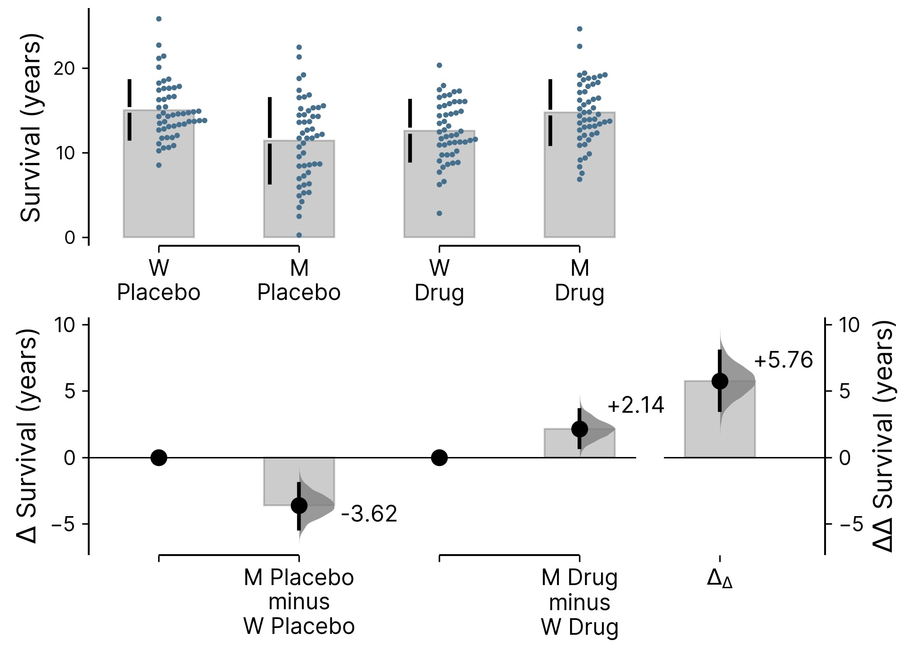

# A Full Circle Moment

*Show your uncertainty out loud, on purpose.*

In 2016 I wrote an email to Adam Claridge-Chang. I had just read his *Nature Methods* piece on estimation statistics, and I told him that I wanted to learn to think the way he did. I had the same frustration he had with p-values and had just learned about bootstrapping in grad school, but significance testing was my bread and butter, and I didn't yet have the language for what bothered me. This week, our new paper on the subject is out in *Nature Methods*. Same journal ten years later: somewhere along the way, that borrowed way of thinking became somewhat my own.

To us, the idea is simple. "Is there a difference?" is almost never the question we actually care about. How big is it? How sure are we? Does it matter? DABEST answers those directly, guiding the eyes towards the quantified effect sizes and confidence intervals instead of an asterisk (or 2, or 3 asterisks).

The raw data, the effect size, and the uncertainty around that effect, in one plot. The rightmost curve is the delta-delta &mdash; the difference between two differences.

The bootstrap-enabled uncertainty quantification is the part I find especially transparent. Error bars derived from a theoretical distribution ask you to accept an assumption about the shape of your data, and that assumption sits somewhere off-screen where nobody inspects it. Bootstrapping asks for much less. You resample the data you actually collected, thousands of times, recompute the effect each time, and the spread of those resampled estimates *is* the interval. A wide distribution tells you that you need more data. A narrow one tells you that you have estimated the effect well. Either way the uncertainty is drawn from your own measurements, and it is visible rather than assumed.

What delights me most is how far the idea travels. I keep meeting the same problem far outside neuroscience and biology: how much did a model improve, how large was a drug's effect, what should we make of a shift in the numbers recorded from our own bodies? The modern world is saturated with automatically collected metrics. Across science and beyond, many of us are trying to understand not merely whether a number moved, but by how much, with what uncertainty, and whether the change is large enough to matter.

And thank you to Adam for showing me how to think clearly and independently across disciplines, challenge conventions that deserve to be challenged, and turn difficult statistical ideas into designs people can actually see and use. And thank you to every co-author and collaborator who kept this idea alive long enough for me to grow into it.

So here is a small, happy manifesto: show your uncertainty out loud, on purpose. Try it out at [estimationstats.com](https://www.estimationstats.com).

---

*The paper is [Getting over ANOVA: estimation graphics for multi-group comparisons &nearr;](https://www.nature.com/articles/s41592-026-03187-7), Nature Methods (2026). For what is actually in it &mdash; repeated measures, delta-delta, proportions, mini-meta &mdash; see [Getting Over ANOVA](01_dabest.html), or try the [demo](../dabest_demo.html).*

Grateful for institutional and funding support from A\*STAR Institute of Molecular and Cell Biology, A\*STAR &mdash; Agency for Science, Technology and Research, Duke-NUS Medical School, and the National Medical Research Council, Singapore during this work.

