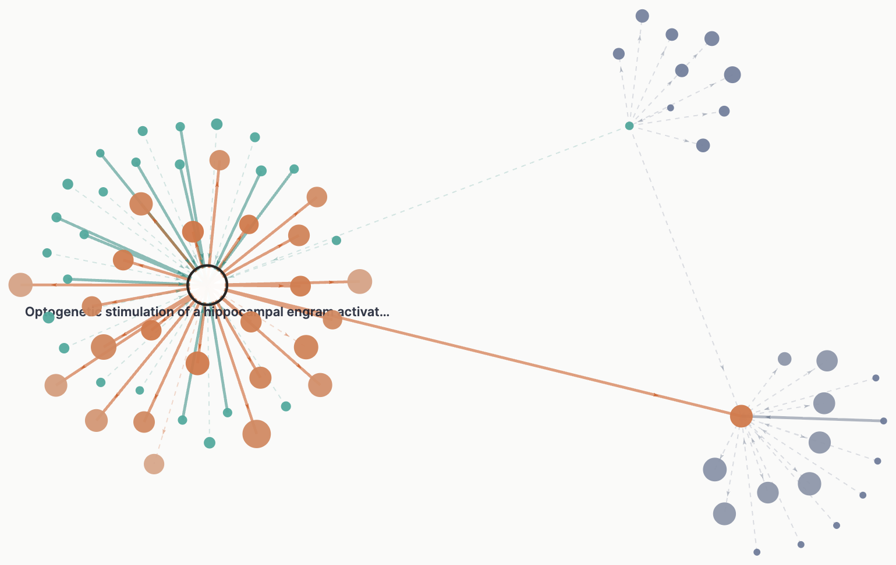

# Every Citation Has Something to Say

*Citation counts tell you that a paper was cited. They never tell you why.*

While doing a lit review last week, I kept wishing I could see the citation relationships as a graph. So I had Kimi K3 build [Gravitas](https://sangyu.github.io/gravitas/). You drop in a paper's DOI, PubMed ID, URL, or title and get a map of its citation neighbourhood. Click on any edge and you get the actual sentence the citing paper wrote about the cited one. Not an AI summary, not a supporting/contrasting label: just the citing sentence. The claims are extracted by string slicing, never generated, so if a sentence appears in Gravitas it appears verbatim in the citing paper. That is enforced by construction rather than by prompt, which is the version of "no hallucinations" I actually trust.

The seed paper is the white node. Teal nodes cite it; orange nodes are cited by it. Node size is citation count, edge length is the log of the publication-year gap, so older work drifts outward. Solid edges have a verbatim claim behind them; dashed edges are paywalled or unindexed. The two satellite clusters appeared when I expanded a neighbour's own citations.

<video src="../images/blog/11_gravitas/demo.mp4" controls loop muted playsinline style="width:100%; border:1px solid var(--border);"></video>

Seed, map, click an edge, read the sentence.

K3 performed incredibly. I gave it maybe ten minutes of design specs, full-text fetching strategies, and fallback plans, then about an hour of debugging, plus a couple of rounds of Claude Code when it got stuck. It did the rest autonomously, in an afternoon. What I want to be precise about is which part of that was mine: not the code, which I could not have written that fast, but knowing in advance which sources to fall back to when the obvious one fails. The agent built exactly the waterfall I described, and the waterfall is the product. It still hiccups on large graphs.

Because the unglamorous half is what makes it work. Semantic Scholar has both the graph and, for about half of all edges, the citing sentence — on a ten-paper adversarial corpus, 708 edges, that tier alone covered 49%. The interesting rescue is PubMed Central. Many paywalled papers deposit NIH- or Wellcome-mandated *author manuscripts* in PMC, and those sit outside the PMC Open Access subset that the existing citation-context corpora are built from. The full text comes back as JATS XML, where every in-text citation is an explicit `<xref ref-type="bibr" rid="...">` pointing at its `<ref>` entry. The citing sentence and its bibliography number are therefore recovered exactly, with no NLP guessing, and one fetch enriches every edge from that paper. That tier took coverage from 49% to 98%, leaving 2% genuinely dark.

The other failure mode surprised me more than paywalls did. Some publishers, like PNAS and Cell Press, contractually strip *reference lists* out of Semantic Scholar. A paper reports 77 references in its metadata and the API returns none, so the edges themselves vanish, not just the claims. That is a much worse outcome than a missing sentence, because the map silently looks sparse rather than broken. Gravitas detects the mismatch at runtime and refetches the backbone from Europe PMC, which returned all 70 references for the same paper, then backfills the citation counts and DOIs that Europe PMC's reference endpoint omits. OpenCitations and Crossref sit behind that again for when Semantic Scholar is rate-limited. Free scholarly APIs truly are gems, and the redundancy between them is the only reason any of this is possible without a backend.

When every tier fails, the edge gets a card that says the paper is paywalled and no claim is retrievable. That is the one rule I would keep if I had to throw out everything else. A tool that quietly generates a plausible-sounding summary for the 2% is worse than useless, because you cannot tell by looking which 2% you are reading.

None of this is a novel idea, and it is worth naming the neighbours. [scite.ai](https://scite.ai) is the commercial incumbent, with over a billion citation statements classified by a deep learning model, on subscription. [Colil](https://colil.dbcls.jp/portal/) and [OpCitance](https://www.nature.com/articles/s41597-023-02134-x) are citation-context corpora built from the PMC Open Access subset. [Local Citation Network](https://localcitationnetwork.github.io/) does client-side multi-source graphs, without contexts. What is different here is narrow: the claims are free, verbatim by construction with no model in the loop, and the author-manuscript tier reaches paywalled papers the OA-subset corpora do not cover.

It is also, unexpectedly, quite beautiful to see. A field's structure drawn by who reached for whom, with the reaching quoted in full.

---

*[Try it live &nearr;](https://sangyu.github.io/gravitas/) &ensp;·&ensp; [GitHub &nearr;](https://github.com/sangyu/gravitas). Fully client-side: no backend, no tracking, nothing leaves your browser except requests to public scholarly APIs. A [free Semantic Scholar key](https://www.semanticscholar.org/product/api) makes it much less rate-limited; it lives in your browser's local storage.*
