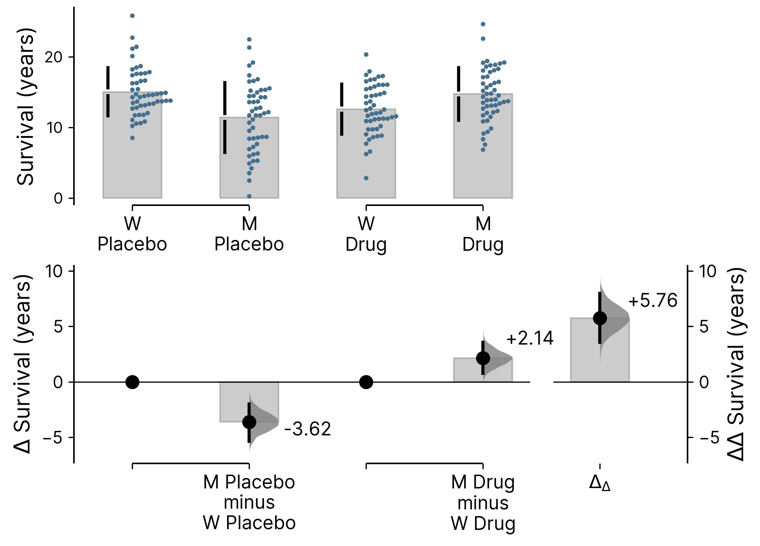
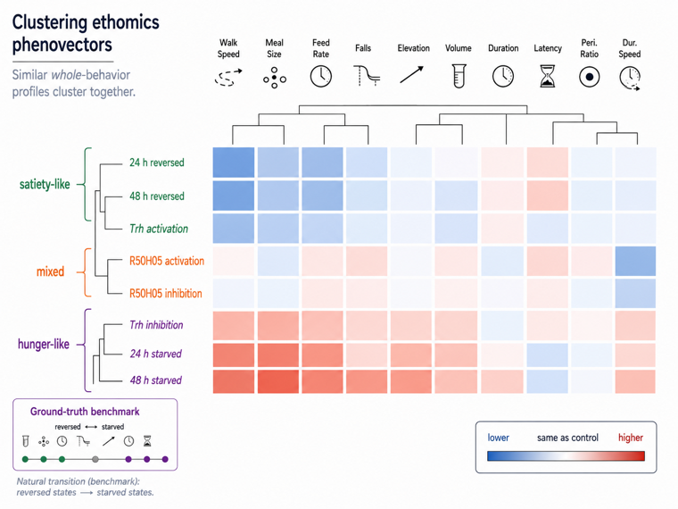
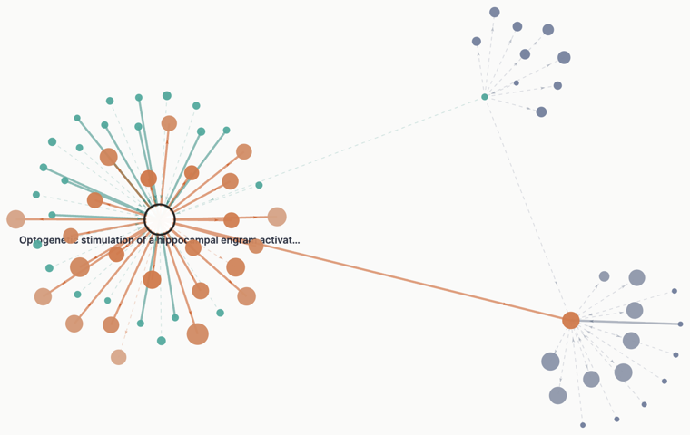
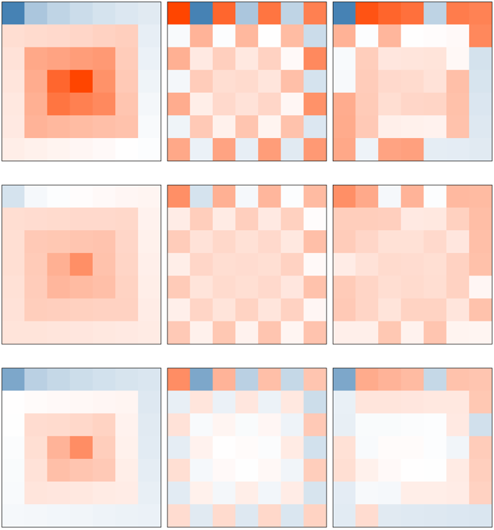
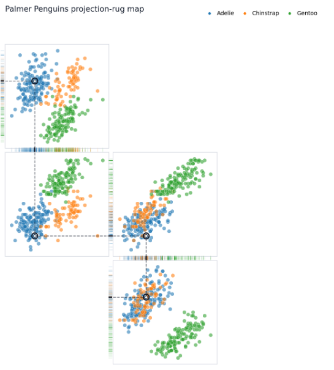

```{=html}
<div class="page-header">
  <h1>Open Source Tools</h1>
  <p class="subtitle">Measurement frameworks for complex, ambiguous systems.</p>
</div>

<div class="research-grid">

  <div class="research-card">
    <div class="research-card-thumb"></div>
    <span class="output-tag">Nature Methods 2026</span>
    <h3>DABEST 2.0</h3>
    <p>
      Bootstrap-coupled effect size estimation for multi-group comparisons.
      Replaces significance testing with estimation graphics: mean differences,
      confidence intervals, and the full sampling distribution of your effect.
      The delta-delta plot handles 2&times;2 factorial designs and beyond.
    </p>
    <a href="https://www.nature.com/articles/s41592-026-03187-7" target="_blank">&rarr; Nature Methods</a> &ensp; <a href="blog/01_dabest.html">Read more</a> &ensp; <a href="dabest_demo.html">Demo &nearr;</a> &ensp; <a href="https://colab.research.google.com/github/sangyu/portfolio/blob/main/nbs/dabest_demo.ipynb" target="_blank">Colab &nearr;</a> &ensp; <a href="https://github.com/ACCLAB/DABEST-python">GitHub &nearr;</a>
  </div>

  <div class="research-card">
    <div class="research-card-thumb"></div>
    <span class="output-tag">bioRxiv 2026</span>
    <h3>DESTRA</h3>
    <p>
      <b>D</b>elta <b>e</b>thomic <b>s</b>tate-<b>t</b>ransition <b>r</b>ecapitulation <b>a</b>ssessment.
      Bootstrap effect size profiles across all measured metrics, anchored to a
      ground-truth reference condition. Asks not whether individual metrics differ,
      but whether the full profile matches the target state.
    </p>
    <a href="https://doi.org/10.64898/2026.07.01.735755" target="_blank">&rarr; bioRxiv</a> &ensp; <a href="blog/02_ethomics.html">Read more</a> &ensp; <a href="https://github.com/sangyu/Ethomics5HT">GitHub &nearr;</a>
  </div>

  <div class="research-card">
    <div class="research-card-thumb"></div>
    <h3>Gravitas</h3>
    <p>
      A citation map where every edge carries the sentence behind it. Drop in a DOI,
      PubMed ID, or title and get the paper's citation neighbourhood; click any edge
      to read the verbatim sentence the citing paper wrote about the cited one. Claims
      are extracted by string slicing, never generated, and an edge with nothing
      retrievable says so instead of inventing a summary.
    </p>
    <a href="https://sangyu.github.io/gravitas/" target="_blank">&rarr; Try it live</a> &ensp; <a href="blog/11_gravitas.html">Read more</a> &ensp; <a href="https://github.com/sangyu/gravitas" target="_blank">GitHub &nearr;</a>
  </div>

  <div class="research-card">
    <div class="research-card-thumb"></div>
    <h3>Whorlmap</h3>
    <p>
      A compact heatmap design for high-dimensional comparisons where each cell encodes
      a full bootstrap/effect-size distribution as a tiny spiral, rather than collapsing
      uncertainty into a single color. Lets readers scan many treatment&ndash;outcome
      contrasts at once while still seeing direction, magnitude, and uncertainty inside
      each cell.
    </p>
    <a href="https://sangyu.github.io/whorlmap-paper/">Demo &nearr;</a> &ensp;
    <a href="https://github.com/sangyu/whorlmap-paper">GitHub &nearr;</a>
  </div>

  <div class="research-card">
    <div class="research-card-thumb"></div>
    <h3>Rugprint</h3>
    <p>
      A compact multivariate fingerprint: selected 2D scatterplot projections arranged
      as a sparse map, with edge rugs — a Tufte idea — showing how the same observations
      collapse onto one-dimensional axes.
    </p>
    <a href="https://sangyu.github.io/rugprint/">Demo &nearr;</a> &ensp;
    <a href="https://github.com/sangyu/rugprint">GitHub &nearr;</a>
  </div>

</div>
```
